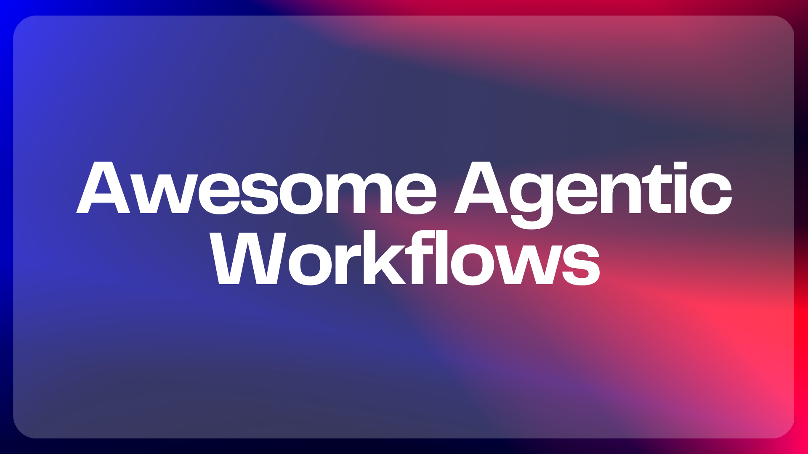

# Awesome Agentic Workflows 

*A curated hub for agent skills, real-world pipelines, and secure execution environments. Unlike other awesome lists that focus on a single layer, this repository organizes the entire agentic stack into three distinct layers **Skills** (what agents can perceive, remember, plan, execute, and communicate), **Workflows** (production patterns that chain skills into end-to-end pipelines), and **Environments** (sandboxed runtimes where untrusted agent code runs safely).*

## The three layers

| Agent Architecture & Infrastructure |
| :---: |
| **Agent Skills**   `Perception · Memory · Planning · Execution · Comms` |
| **Real-World Workflows**   `Research · Code gen · Data pipelines · Browser auto` |
| **Secure Execution Environments**   `Hosted sandboxes · VMs · Containers · Serverless` |

## Table of contents

- [Agent skills library](#agent-skills-library)
  - [Perception](#perception)
  - [Memory](#memory)
  - [Planning](#planning)
  - [Execution](#execution)
  - [Communication](#communication)
- [Real-world workflows](#real-world-workflows)
  - [Research and summarization](#research-and-summarization)
  - [Code generation](#code-generation)
  - [Data pipelines](#data-pipelines)
  - [Browser automation](#browser-automation)
  - [Multi-step reasoning](#multi-step-reasoning)
- [Secure execution environments](#secure-execution-environments)
  - [Hosted sandboxes](#hosted-sandboxes)
  - [Self-hosted VMs](#self-hosted-vms)
  - [Containers](#containers)
  - [Serverless runtimes](#serverless-runtimes)
- [Frameworks and orchestration](#frameworks-and-orchestration)
- [Learning resources and patterns](#learning-resources-and-patterns)
- [Contributing](#contributing)
- [License](#license)

---

## Agent skills library

Detailed write-ups for each category live in the [`skills/`](skills/) directory.

### Perception

Tools that let agents see, read, and parse the external world.

**[Firecrawl](https://github.com/mendableai/firecrawl)** — Crawls websites and returns clean markdown ready for LLM consumption. Tags: `perception` `python` `typescript`

**[Crawl4AI](https://github.com/unclecode/crawl4ai)** — Extracts structured data from web pages using LLM-friendly output formats. Tags: `perception` `python`

**[Docling](https://github.com/DS4SD/docling)** — Parses PDFs, DOCX, and slides into structured text with layout understanding. Tags: `perception` `python`

**[Marker](https://github.com/VikParuchuri/marker)** — Converts PDF to markdown with high accuracy for tables, equations, and figures. Tags: `perception` `python`

**[Unstructured](https://github.com/Unstructured-IO/unstructured)** — Ingests and preprocesses documents across 25+ file types for downstream LLM use. Tags: `perception` `python` `pipeline`

**[Surya](https://github.com/VikParuchuri/surya)** — Runs OCR and layout detection on documents in 90+ languages. Tags: `perception` `python`

**[Jina Reader](https://github.com/jina-ai/reader)** — Converts any URL to LLM-ready text via a simple API prefix. Tags: `perception` `typescript`

**[Browser Use](https://github.com/browser-use/browser-use)** — Gives LLM agents full browser control for web interaction and data extraction. Tags: `perception` `execution` `python`

### Memory

Systems that let agents store, retrieve, and reason over past interactions.

**[Mem0](https://github.com/mem0ai/mem0)** — Adds persistent, personalized memory to LLM agents across sessions. Tags: `memory` `python`

**[Chroma](https://github.com/chroma-core/chroma)** — Embeds and retrieves documents as a lightweight vector store for agents. Tags: `memory` `python` `typescript`

**[Weaviate](https://github.com/weaviate/weaviate)** — Stores and searches vector embeddings with hybrid keyword+semantic retrieval. Tags: `memory` `go` `python`

**[Qdrant](https://github.com/qdrant/qdrant)** — Provides high-performance vector similarity search with filtering. Tags: `memory` `rust` `python`

**[Milvus](https://github.com/milvus-io/milvus)** — Scales vector search to billions of embeddings for large agent knowledge bases. Tags: `memory` `go` `python`

**[LanceDB](https://github.com/lancedb/lancedb)** — Runs serverless vector search embedded directly in the agent process. Tags: `memory` `rust` `python` `typescript`

**[Zep](https://github.com/getzep/zep)** — Enriches agent memory with automatic summarization and entity extraction. Tags: `memory` `python` `typescript`

**[Motorhead](https://github.com/getmetal/motorhead)** — Manages conversation context windows with automatic summarization. Tags: `memory` `rust` `python`

### Planning

Strategies and frameworks that let agents decompose tasks and decide what to do next.

**[LangGraph](https://github.com/langchain-ai/langgraph)** — Orchestrates multi-step agent workflows as stateful, cyclical graphs. Tags: `planning` `orchestration` `python` `typescript` `langgraph`

**[DSPy](https://github.com/stanfordnlp/dspy)** — Optimizes LLM prompts and chains programmatically instead of manually. Tags: `planning` `python`

**[AutoGen](https://github.com/microsoft/autogen)** — Coordinates multi-agent conversations for collaborative task decomposition. Tags: `planning` `orchestration` `python` `autogen`

**[Pydantic AI](https://github.com/pydantic/pydantic-ai)** — Structures agent outputs and tool calls with type-safe validation. Tags: `planning` `execution` `python`

**[LATS](https://github.com/larats-x/lats)** — Combines Monte Carlo tree search with LLM reasoning for complex planning. Tags: `planning` `python`

**[Reflexion](https://github.com/noahshinn/reflexion)** — Lets agents learn from mistakes via verbal self-reflection loops. Tags: `planning` `python`

**[Tree of Thoughts](https://github.com/princeton-nlp/tree-of-thought-llm)** — Explores multiple reasoning paths in parallel before committing. Tags: `planning` `python`

**[OpenDevin](https://github.com/OpenDevin/OpenDevin)** — Plans and executes multi-step software engineering tasks autonomously. Tags: `planning` `execution` `python`

### Execution

Tools that let agents run code, call APIs, and take actions in the real world.

**[E2B](https://github.com/e2b-dev/e2b)** — Runs agent-generated code in secure cloud sandboxes with sub-second start. Tags: `execution` `sandbox` `python` `typescript` `e2b`

**[Composio](https://github.com/ComposioHQ/composio)** — Connects agents to 250+ external tools and APIs with managed auth. Tags: `execution` `python` `typescript` `composio`

**[Toolhouse](https://github.com/toolhouseai/toolhouse-sdk-python)** — Provides a hosted tool execution layer for function calling agents. Tags: `execution` `python`

**[Open Interpreter](https://github.com/OpenInterpreter/open-interpreter)** — Executes code locally through a natural language interface. Tags: `execution` `python`

**[MCP (Model Context Protocol)](https://github.com/modelcontextprotocol/servers)** — Standardizes how agents discover and call external tools via a protocol. Tags: `execution` `python` `typescript`

**[CrewAI Tools](https://github.com/crewAIInc/crewAI-tools)** — Bundles pre-built tools for search, scraping, and file operations in agent pipelines. Tags: `execution` `python` `crewai`

**[LangChain Tools](https://github.com/langchain-ai/langchain/tree/master/libs/community)** — Provides 100+ integrations for search, math, databases, and APIs. Tags: `execution` `python` `langchain`

**[Semantic Kernel](https://github.com/microsoft/semantic-kernel)** — Integrates LLM function calling with enterprise plugins and planners. Tags: `execution` `planning` `python` `typescript`

### Communication

Capabilities that let agents send messages, notifications, and reports to humans.

**[Novu](https://github.com/novuhq/novu)** — Routes agent notifications across email, SMS, push, and chat from a single API. Tags: `communication` `typescript` `python`

**[Resend](https://github.com/resend/resend-node)** — Sends transactional emails from agents with a developer-first API. Tags: `communication` `typescript`

**[Slack Bolt](https://github.com/slackapi/bolt-python)** — Enables agents to send, receive, and react to Slack messages. Tags: `communication` `python`

**[Twilio Python](https://github.com/twilio/twilio-python)** — Sends SMS and voice calls from agent workflows. Tags: `communication` `python`

**[Ntfy](https://github.com/binwiederhier/ntfy)** — Pushes real-time notifications to phones and desktops via a simple HTTP API. Tags: `communication` `go`

**[Apprise](https://github.com/caronc/apprise)** — Sends notifications to 100+ services from a single Python interface. Tags: `communication` `python`

**[Discord.py](https://github.com/Rapptz/discord.py)** — Lets agents interact with Discord channels for team-facing communication. Tags: `communication` `python`

**[FastAPI-Mail](https://github.com/sabuhish/fastapi-mail)** — Adds email sending capability to FastAPI-based agent services. Tags: `communication` `python`

---

## Real-world workflows

Detailed write-ups for each workflow live in the [`workflows/`](workflows/) directory.

### Research and summarization

**[GPT Researcher](https://github.com/assafelovic/gpt-researcher)** — Conducts multi-source web research and produces cited reports autonomously. Tags: `pipeline` `perception` `python`

**[STORM](https://github.com/stanford-oval/storm)** — Generates Wikipedia-style articles by researching and synthesizing multiple sources. Tags: `pipeline` `planning` `python`

**[Tavily](https://github.com/tavily-ai/tavily-python)** — Provides search API optimized for LLM agents needing real-time web data. Tags: `perception` `python`

### Code generation

**[Aider](https://github.com/paul-gauthier/aider)** — Edits code across multiple files in a git repo via natural language. Tags: `execution` `python`

**[SWE-agent](https://github.com/princeton-nlp/SWE-agent)** — Resolves GitHub issues autonomously by reading, planning, and patching code. Tags: `execution` `planning` `python`

**[Continue](https://github.com/continuedev/continue)** — Adds AI code assistance directly inside VS Code and JetBrains IDEs. Tags: `execution` `typescript`

### Data pipelines

**[Hamilton](https://github.com/DAGWorks-Inc/hamilton)** — Defines data transformations as Python functions wired into a DAG. Tags: `pipeline` `python`

**[Prefect](https://github.com/PrefectHQ/prefect)** — Orchestrates data workflows with retries, caching, and observability. Tags: `pipeline` `python`

**[Dagster](https://github.com/dagster-io/dagster)** — Manages data assets and pipelines with built-in lineage tracking. Tags: `pipeline` `python`

### Browser automation

**[Playwright](https://github.com/microsoft/playwright)** — Automates Chromium, Firefox, and WebKit browsers with a single API. Tags: `execution` `perception` `python` `typescript`

**[Skyvern](https://github.com/Skyvern-AI/skyvern)** — Automates browser workflows using vision models instead of DOM selectors. Tags: `execution` `perception` `python`

**[AgentQL](https://github.com/AgentQL/agentql)** — Queries web page elements using natural language instead of CSS selectors. Tags: `perception` `python`

### Multi-step reasoning

**[LangGraph](https://github.com/langchain-ai/langgraph)** — Builds stateful, multi-step agent loops with branching and human-in-the-loop. Tags: `planning` `orchestration` `python` `langgraph`

**[Burr](https://github.com/DAGWorks-Inc/burr)** — Tracks and manages multi-step agent state machines with observability. Tags: `planning` `python`

---

## Secure execution environments

Detailed write-ups live in the [`environments/`](environments/) directory.

### Hosted sandboxes

| Tool | Isolation | Cold start | SDK languages | Notes |
|------|-----------|------------|---------------|-------|
| **[E2B](https://github.com/e2b-dev/e2b)** | VM (Firecracker) | ~300ms | Python, TS, Go | Custom sandbox templates, persistent filesystems |
| **[Modal](https://github.com/modal-labs/modal-client)** | Container + gVisor | ~500ms | Python | GPU support, distributed execution |
| **[Daytona](https://github.com/daytonaio/daytona)** | Container / VM | ~2s | Python, TS, Go | Self-hostable, git-based dev environments |
| **[CodeSandbox SDK](https://github.com/codesandbox/codesandbox-sdk)** | VM (microVM) | ~1s | Python, TS | Forking, snapshots, real-time collaboration |

### Self-hosted VMs

| Tool | Isolation | Cold start | SDK languages | Notes |
|------|-----------|------------|---------------|-------|
| **[Firecracker](https://github.com/firecracker-microvm/firecracker)** | microVM | ~125ms | REST API | Used by AWS Lambda and E2B under the hood |
| **[Kata Containers](https://github.com/kata-containers/kata-containers)** | VM-isolated containers | ~1s | OCI compatible | Combines VM security with container UX |
| **[gVisor](https://github.com/google/gvisor)** | User-space kernel | ~200ms | OCI compatible | Intercepts syscalls without full VM overhead |

### Containers

| Tool | Isolation | Cold start | SDK languages | Notes |
|------|-----------|------------|---------------|-------|
| **[Docker](https://github.com/moby/moby)** | Namespace + cgroup | ~500ms | All | Standard agent isolation, wide ecosystem |
| **[Podman](https://github.com/containers/podman)** | Rootless container | ~500ms | All | Daemonless, rootless — better for untrusted agent code |
| **[Sysbox](https://github.com/nestybox/sysbox)** | Enhanced container | ~1s | All | Runs Docker-in-Docker securely for nested agent envs |

### Serverless runtimes

| Tool | Isolation | Cold start | SDK languages | Notes |
|------|-----------|------------|---------------|-------|
| **[AWS Lambda](https://github.com/aws/aws-lambda-python-runtime-interface-client)** | Firecracker VM | ~200ms–1s | Python, TS, Go, Rust | 15-minute max execution, 10GB memory |
| **[Google Cloud Run](https://github.com/GoogleCloudPlatform/cloud-run-samples)** | gVisor | ~500ms–2s | All | Request-based scaling, up to 60 min timeout |
| **[Cloudflare Workers](https://github.com/cloudflare/workers-sdk)** | V8 isolate | ~0ms | TS, Rust (WASM) | Ultra-fast but limited runtime APIs |

---

## Frameworks and orchestration

These frameworks wire skills, workflows, and environments together into complete agent systems.

| Framework | Language | Key strength | Best for |
|-----------|----------|-------------|----------|
| **[LangGraph](https://github.com/langchain-ai/langgraph)** | Python, TS | Stateful graph-based orchestration with cycles | Complex multi-step agents needing branching and loops |
| **[CrewAI](https://github.com/crewAIInc/crewAI)** | Python | Role-based multi-agent collaboration | Teams of specialized agents working together |
| **[AutoGen](https://github.com/microsoft/autogen)** | Python | Multi-agent conversation patterns | Research, brainstorming, and code generation workflows |
| **[Haystack](https://github.com/deepset-ai/haystack)** | Python | Pipeline-based composability | RAG and document processing pipelines |
| **[Pydantic AI](https://github.com/pydantic/pydantic-ai)** | Python | Type-safe agent definitions | Production agents needing structured, validated outputs |
| **[LlamaIndex Workflows](https://github.com/run-llama/llama_index)** | Python, TS | Event-driven async workflows | Data-heavy agents with complex retrieval needs |
| **[Agency Swarm](https://github.com/VRSEN/agency-swarm)** | Python | OpenAI Assistants API orchestration | Multi-agent systems using OpenAI's native tools |
| **[Composio](https://github.com/ComposioHQ/composio)** | Python, TS | 250+ tool integrations with managed auth | Agents that need to call many external APIs |

---

## Learning resources and patterns

In-depth explanations of common agentic patterns live in the [`patterns/`](patterns/) directory.

| Pattern | File | When to use |
|---------|------|-------------|
| ReAct (Reasoning + Acting) | [react-pattern.md](patterns/react-pattern.md) | Single-agent tasks needing interleaved reasoning and tool use |
| Plan-and-execute | [plan-and-execute.md](patterns/plan-and-execute.md) | Complex tasks that benefit from upfront decomposition |
| Reflection loop | [reflection-loop.md](patterns/reflection-loop.md) | Tasks where the agent should critique and improve its own output |
| Multi-agent collaboration | [multi-agent.md](patterns/multi-agent.md) | Problems requiring diverse expertise or parallel workstreams |

---

## Contributing

We welcome contributions! This list is curated, not comprehensive — every entry must answer the question: _"What does this enable an agent to do that it couldn't do before?"_

Read the full contribution guidelines in [CONTRIBUTING.md](CONTRIBUTING.md) before submitting a PR. The short version: include a working URL, an OSS license, a one-sentence description you wrote yourself, and the correct tags from our taxonomy.

---

## License

[MIT](LICENSE) © 2026 Awesome Agentic Workflows Contributors
