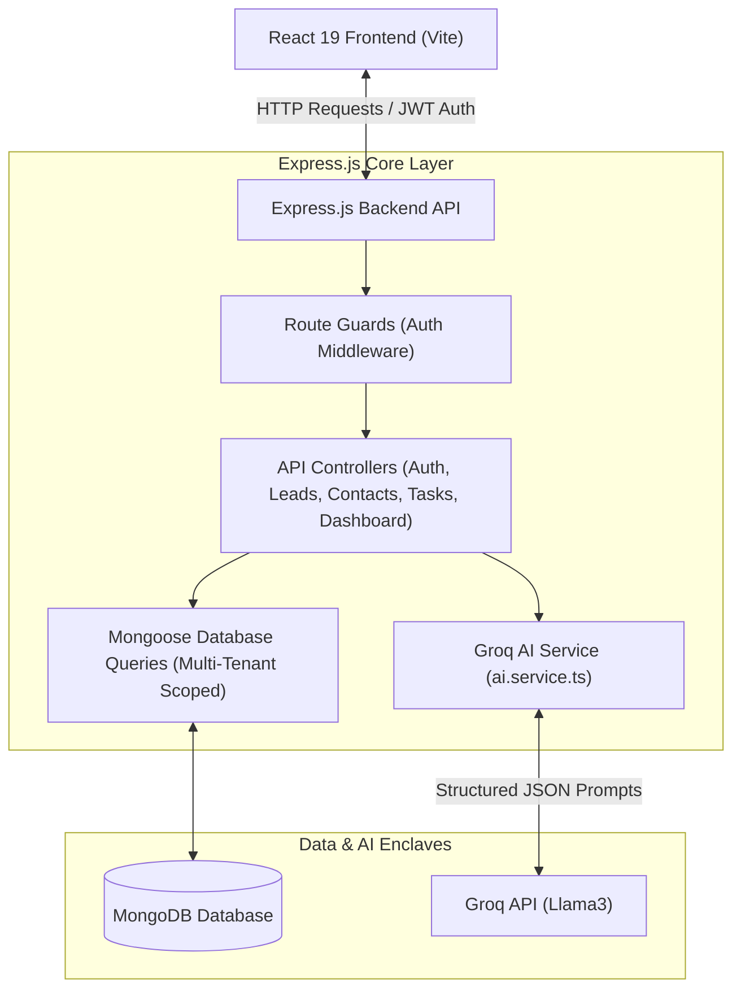

# Full Stack AI CRM Dashboard Application

A multi-tenant, type-safe Customer Relationship Management (CRM) dashboard designed for B2B SaaS platforms. This application leverages artificial intelligence from Groq to analyze deals, draft communications, and audit pipelines, featuring a clean layout with tabular and Kanban views.


## Core Features

- **Secure Authentication:** Session persistence with JWT and bcrypt hashing under strict multi-tenant request scoping.
- **Leads Management:** Full CRUD deals board with live search, stage filtering, sortable columns, bulk deletion, and CSV export.
- **Sales Pipeline:** Interactive Kanban board featuring drag-and-drop actions, per-stage valuation aggregates, and optimistic state updates.
- **Contacts Directory:** Searchable and taggable contact grid with a favorites toggle and detailed profile drawers.
- **Follow-ups and Notes:** Lead-linked notes with pinning, due-date task checklists, and status progress bars.
- **Analytics Dashboard:** Optimized MongoDB aggregation pipeline reporting pipeline velocity, KPI metrics, and win-revenue charts.
- **Groq AI Actions:** Fast, structured JSON-schema summaries, outreach email copy generator, and automated pipeline health audits.

### User Flow

Based on my analysis of the project structure, here is the typical user flow for the AI CRM Dashboard application:

#### 1. New User Registration

1.  A new user starts at the `/register` page.
2.  They fill out a registration form with their name, email, and password.
3.  Upon submission, the system creates a new user account and automatically logs them in.
4.  The user is then redirected to the main `/dashboard`.

#### 2. Existing User Login

1.  An existing user navigates to the `/login` page.
2.  They enter their email and password.
3.  The system validates their credentials. On success, it logs them in and redirects them to the `/dashboard`.
4.  If a user has a valid session from a previous login, they will be taken directly to the `/dashboard`, skipping the login screen.

#### 3. Core Application Usage (Authenticated User)

#### 3. Guest / Demo Login

1.  A new visitor can click the "Log in as Guest / Demo" button on the login page.
2.  The system instantly creates a temporary account, populates it with sample data (leads, contacts, tasks), and logs the user in.
3.  This provides immediate access to a fully-featured dashboard to explore the CRM's capabilities.

#### 4. Core Application Usage (Authenticated User)

Once logged in, the user interacts with the application within a consistent dashboard layout.

1.  **Dashboard (`/dashboard`):** This is the landing page. It provides a high-level overview of key metrics and recent activity, likely pulling summary data for leads, tasks, and contacts.

2.  **Lead Management (`/leads`):**
    *   The user can view all sales leads in two formats: a Kanban-style board (with columns for stages like 'New', 'Qualified', 'Won') or a sortable/filterable table.
    *   They can create a new lead by filling out a form with details like the deal name, value, and associated contact.
    *   They can update a lead's stage by dragging and dropping it between columns on the Kanban board.
    *   They can open a detailed view for any lead to see more information, add notes, or edit its properties.
    *   They have options to search, filter, and export the leads list to a CSV file.

3.  **Contact Management (`/contacts`):**
    *   The user can navigate to the contacts page to view a list of all contacts.
    *   From here, they can create, view, edit, and delete contact information.

4.  **Task Management (`/tasks`):**
    *   The user can visit the tasks page to manage their to-do items.
    *   This section allows them to create new tasks, assign them, set due dates, and mark them as complete.

#### 5. Logout

*   When finished, the user can click a "Logout" button, which clears their session and redirects them back to the `/login` page.


## System Architecture



## Technology Stack

### Backend
- Node.js
- Express.js
- TypeScript (strict configuration enabled)
- MongoDB / Mongoose

### Frontend
- React 19
- Vite
- Tailwind CSS v4
- Recharts (Data Visualization)

### Integrations and Core APIs
- Google Gemini API (google/generative-ai SDK)
- Groq API (groq-sdk)
- JSON Web Token (JWT)
- bcryptjs

## Demos


## Local Setup and Installation

### Prerequisites
- Node.js (version 18 or higher)
- MongoDB (running locally on port 27017, or a remote MongoDB Atlas connection URI)

### Configuration Setup
Create a file named `.env` in the `backend/` folder and configure the following variables:
```env
PORT=5000
MONGO_URI=mongodb://127.0.0.1:27017/ai-crm-dashboard
JWT_SECRET=your_jwt_secret_key_here
JWT_EXPIRES_IN=7d
GEMINI_API_KEY=your_gemini_api_key_here
NODE_ENV=development
GROQ_API_KEY=your_groq_api_key_here
```

### Installation Steps

1. Clone the project repository and navigate to the project directory.

2. Install and launch the Backend Server:
   ```bash
   cd backend
   npm install
   npm run dev # or 'npm run server' if you prefer that name
   ```
   The backend server will start listening on `http://localhost:5000`.

3. In a new terminal window, install and launch the Frontend Client:
   ```bash
   cd frontend
   npm install --legacy-peer-deps
   npm run dev
   ```
   *Note: Using `--legacy-peer-deps` avoids peer resolution issues with React 19 on older packages.*
   
   The Vite dev server will start on `http://localhost:3000`.

4. Open `http://localhost:3000` in your web browser. Click the registration link to create a new tenant account and sign in.

## Contributing and License

### Contributing
Contributions to improve functionality, clean code architecture, or UI elements are welcome. Please read our [**Contributing Guidelines**](CONTRIBUTING.md) to get started.

### License
This project is licensed under the MIT License. Details can be found in the [LICENSE](LICENSE) file.
