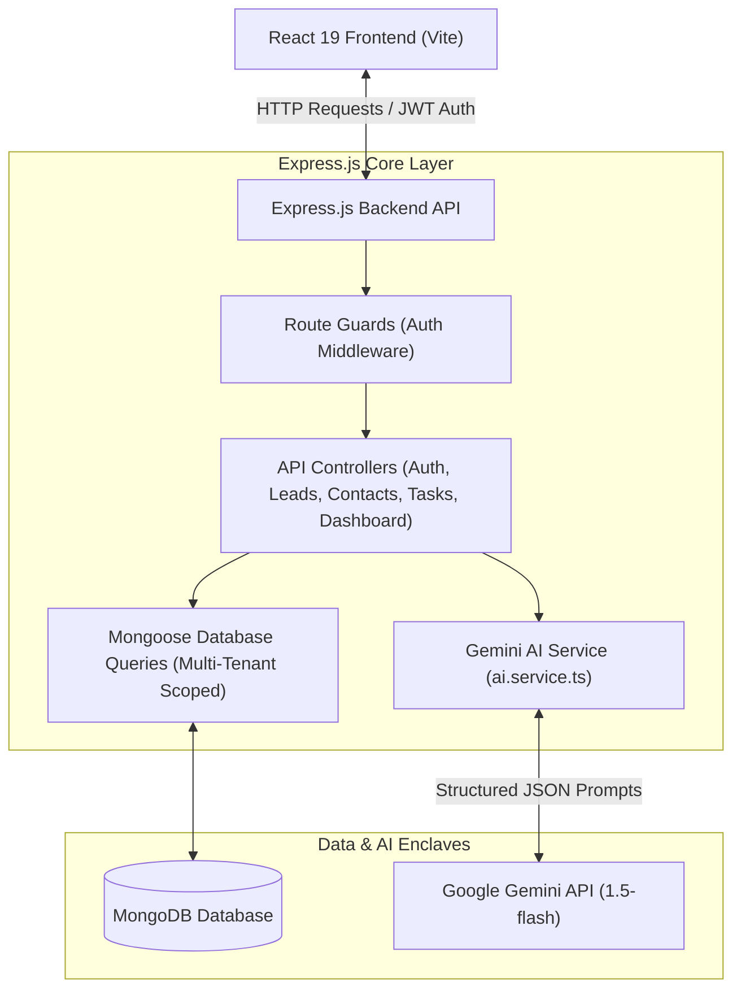

# Full-Stack AI CRM Dashboard Application

A multi-tenant, type-safe Customer Relationship Management (CRM) dashboard designed for B2B SaaS platforms. This application leverages artificial intelligence to analyze deals, draft communications, and audit pipelines, featuring a clean layout with tabular and Kanban views.


## Core Features

- **Secure Authentication:** Session persistence with JWT and bcrypt hashing under strict multi-tenant request scoping.
- **Leads Management:** Full CRUD deals board with live search, stage filtering, sortable columns, bulk deletion, and CSV export.
- **Sales Pipeline:** Interactive Kanban board featuring drag-and-drop actions, per-stage valuation aggregates, and optimistic state updates.
- **Contacts Directory:** Searchable and taggable contact grid with a favorites toggle and detailed profile drawers.
- **Follow-ups and Notes:** Lead-linked notes with pinning, due-date task checklists, and status progress bars.
- **Analytics Dashboard:** Optimized MongoDB aggregation pipeline reporting pipeline velocity, KPI metrics, and win-revenue charts.
- **Gemini AI Actions:** Structured JSON-schema summaries, outreach email copy generator, and automated pipeline health audits.


## System Architecture




## Technology Stack

### Backend
- Node.js
- Express.js
- TypeScript (strict configuration enabled)
- MongoDB / Mongoose

### Frontend
- React 19
- Vite
- Tailwind CSS v4
- Recharts (Data Visualization)

### Integrations and Core APIs
- Google Gemini API (google/generative-ai SDK)
- JSON Web Token (JWT)
- bcryptjs


## Local Setup and Installation

### Prerequisites
- Node.js (version 18 or higher)
- MongoDB (running locally on port 27017, or a remote MongoDB Atlas connection URI)

### Configuration Setup
Create a file named `.env` in the `backend/` folder and configure the following variables:
```env
PORT=5000
MONGO_URI=mongodb://127.0.0.1:27017/ai-crm-dashboard
JWT_SECRET=your_jwt_secret_key_here
JWT_EXPIRES_IN=7d
GEMINI_API_KEY=your_gemini_api_key_here
NODE_ENV=development
```

### Installation Steps

1. Clone the project repository and navigate to the project directory.

2. Install and launch the Backend Server:
   ```bash
   cd backend
   npm install
   npm run dev
   ```
   The backend server will start listening on `http://localhost:5000`.

3. In a new terminal window, install and launch the Frontend Client:
   ```bash
   cd frontend
   npm install --legacy-peer-deps
   npm run dev
   ```
   *Note: Using `--legacy-peer-deps` avoids peer resolution issues with React 19 on older packages.*
   
   The Vite dev server will start on `http://localhost:3000`.

4. Open `http://localhost:3000` in your web browser. Click the registration link to create a new tenant account and sign in.

## Contributing and License

### Contributing
Contributions to improve functionality, clean code architecture, or UI elements are welcome. Please open an issue to discuss proposed enhancements before submitting a pull request.

### License
This project is licensed under the MIT License. Details can be found in the LICENSE file.
